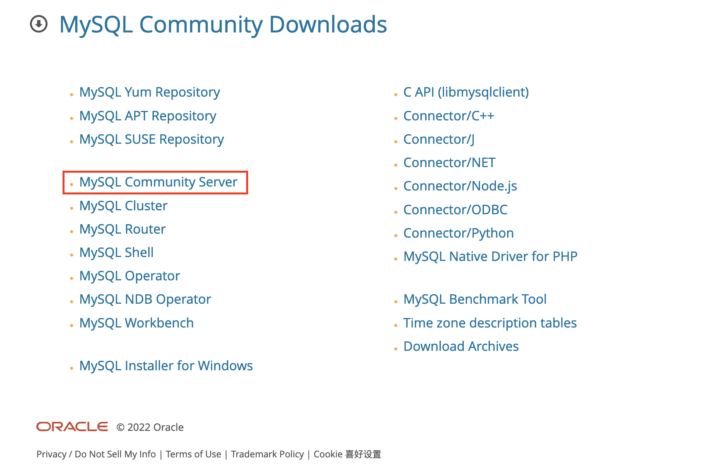
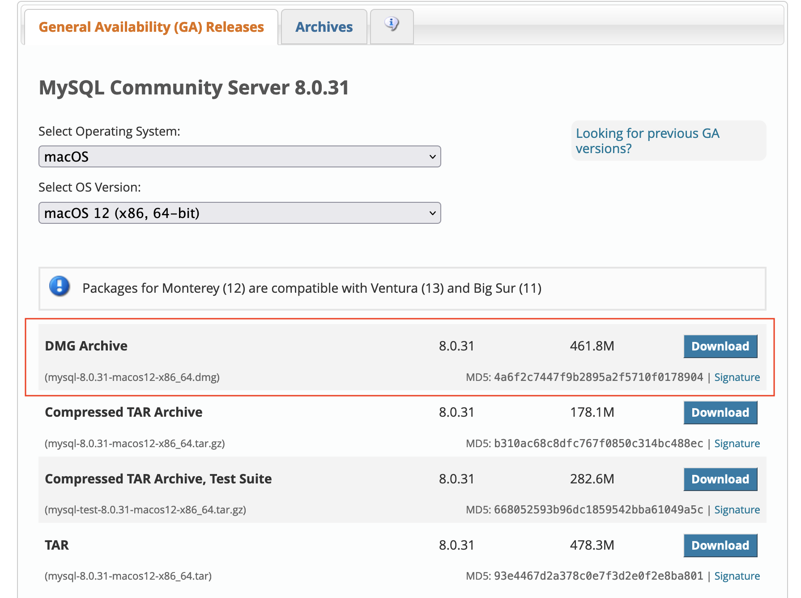
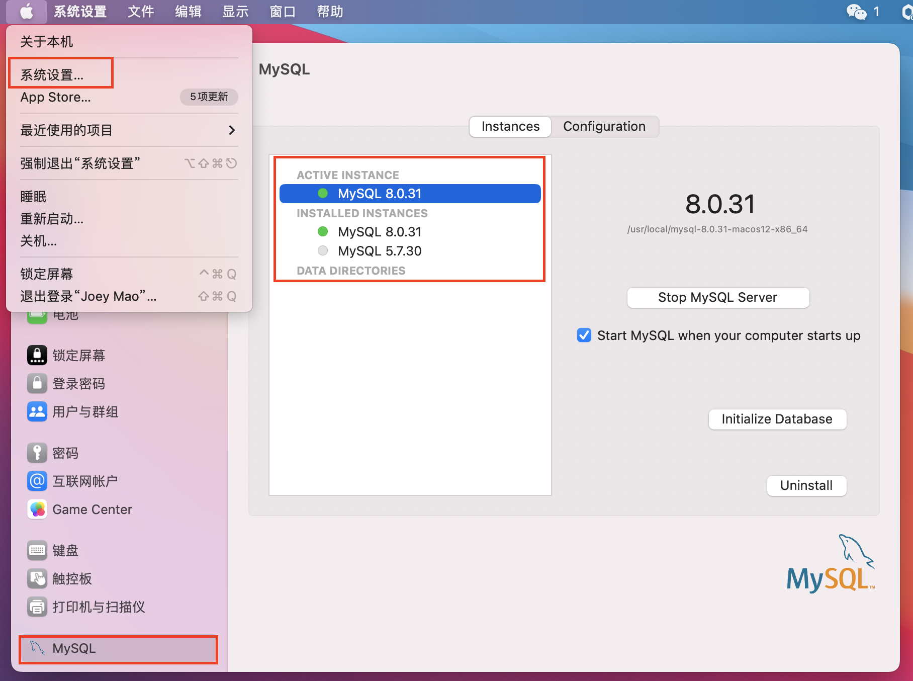
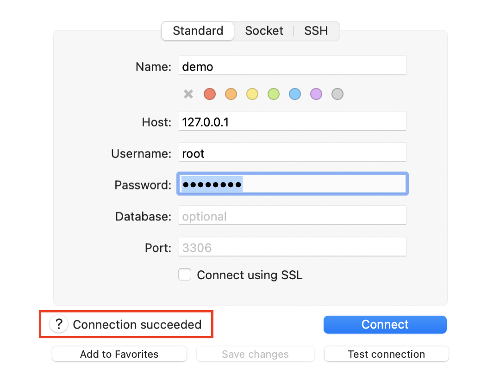
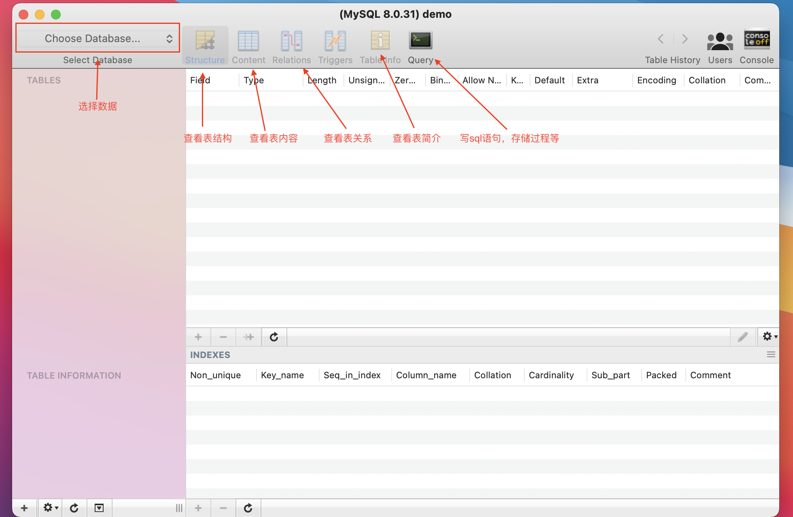
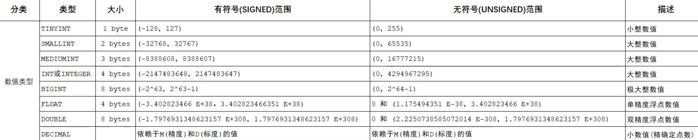
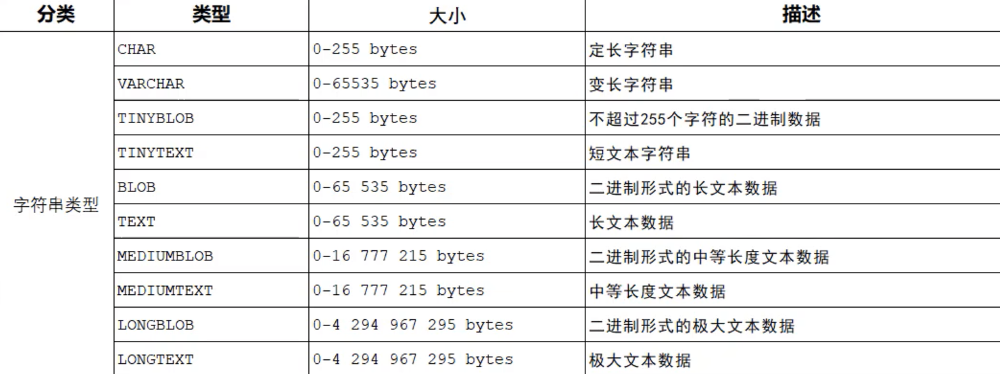
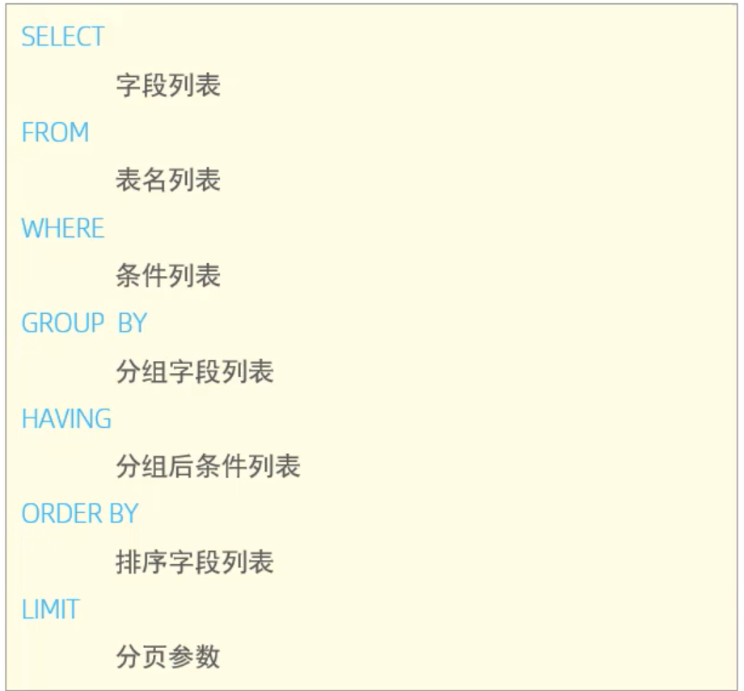
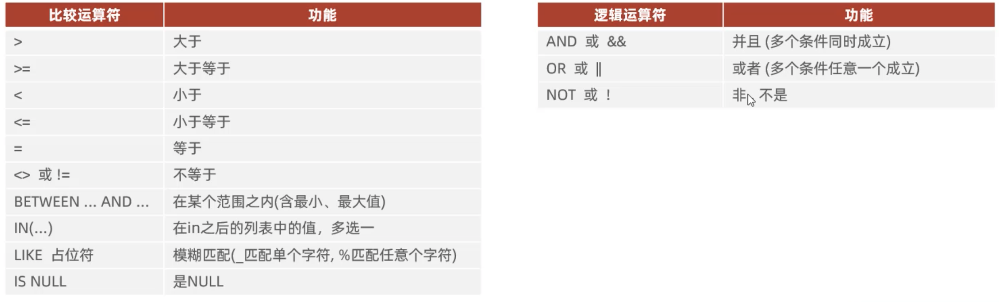
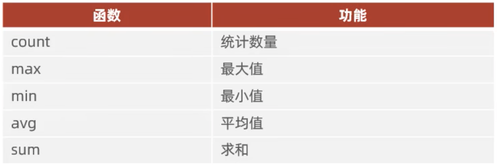

## 安装及启动

<style>
   @import "../../css/style.css"
</style>

<div class="body">
    <div class="content">
        <span class="title">注意</span><br/>
        <span>此处只适用于ios系统</span>
    </div>
</div>

**下载安装包**

[https://dev.mysql.com/downloads/](https://dev.mysql.com/downloads/)

**选择需要安装的版本**



**根据需要选择（我一般选择.dmg）**



**启动mysql**



**配置环境变量**

此时输入`mysql -uroot -p`，会提示没有 ***commod not found***。

1. 进入/usr/local/mysql/bin，查看此目录下是否有mysql

`cd  /usr/local/mysql/bin`

2. 打开 ~/.bash_profile 文件

`open ~/.bash_profile`

3. 添加 path

`export PATH=$PATH:/usr/local/mysql/bin`

4. 再次输入 `mysql -uroot -p`，登录mysql


**启动服务**

`sudo mysql.server start`

**关闭服务**

`sudo mysql.server stop`


**查看状态**

`sudo mysql.server status`


## Sequel Pro

<div class="body" style="margin-top: 20px;">
    <div class="content">
        <span class="title">说明</span><br/>
        <span>我也想用navicat，耐不住它要收费啊！</span>
    </div>
</div>

**下载地址**

[https://sequelpro.com/download](https://sequelpro.com/download)

**连接数据库**



填好参数之后，点击 *test connection* 按钮；如上图所示，测试通过后，再点击 *connect* 连接数据库。

**基本用法**



## 概述

**关系型数据库（RDBMS）**

**概念:**

建立在关系模型基础上，由多张相互连接的二维表组成的数据库。

**特点:**
1. 使用表存储数据，格式统一，便于维护。
2. 使用sql语言操作，标准统一，使用方便。

## SQL通用语法

1. sql语句可以单行或多行写，以分号结尾。
2. sql语句可以使用空格/缩进来增加语句的可读性。
3. mysql数据库的sql语句是不区分大小写的，关键字建议使用大写。
4. 单行用：-- 或 # 注释；多行用 /* */ 注释。

## SQL分类

|  分类   | 说明  |
|  ----  | ----  |
| DDL  | 数据定义语言，用于定义数据库对象（数据库，表，字段） |
| DML  | 数据操作语言，用来对数据库表中的数据进行增删改查 |
| DQL  | 数据查询语言，用来查询数据库中表的记录 |
| DCL  | 数据控制语言，用来创建数据库用户，控制数据库的访问权限 |

## DDL数据类型

**数值类型**



**字符串类型**



**时间类型**


## DDL操作数据库

**查询所有数据库**

```
SHOW DATABASES;
```

**查询当前数据库**

```
SELECT DATABASE();
```

**创建数据库**

```
CREATE DATABASE [IF NOT EXISTS] 数据库名 [DEFAULT CHARSET 字符集][COLLATE 排序规则];
```

**删除数据库**

```
DROP DATABASE IF EXISTS 数据库名;
```

**使用数据库**

```
USE 数据库名;
```

## DDL表的创建

```
CREATE TABLE 表名(
    字段1 字段类型 [COMMENT '注释'],
    字段2 字段类型 [COMMENT '注释'],
    字段3 字段类型 [COMMENT '注释'],
    ···
    字段n 字段类型 [COMMENT '注释']
) [COMMENT '注释'];
```

<div class="body">
    <div class="content">
        <span class="title">注意</span><br/>
        <span>最后一个字段后面没有逗号！</span>
    </div>
</div>

## DDL表的查询

**查询当前数据库所有表**

```
SHOW TABLES;
```

**查询表结构**

```
DESC 表名;
```

**查询指定表的创表语句**

```
SHOW CREATE TABLE 表名;
```
## DDL表的修改

**添加字段**

```
ALTER TABLE 表名 ADD 字段名 字段类型（长度）[COMMENT '注释'] [约束];
```

**修改数据类型**

```
ALTER TABLE 表名 MODIFY 字段名 新数据类型（长度）;
```

**修改字段名和字段类型**

```
ALTER 表名 CHANGE 旧字段名 新字段名 数据类型（长度）[COMMENT '注释'] [约束];
```

**修改表名**

```
ALTER TABLE 表名 RENAME TO 新表名;
```

## DDL表的删除

**删除字段**

```
ALTER TABLE 表名 DROP 字段名;
```

**删除表**

```
DROP TABLE [IF EXISTS] 表名;
```

**删除指定表，并创建该表**

```
TRUNCATE TABLE 表名;
```

## DML添加数据

**给指定字段添加数据**

```
INSERT INTO 表名 (字段1, 字段2, ...) VALUES(值1, 值2, ...);
```

**给全部字段添加数据**

```
INSERT INTO 表名 VALUES(值1, 值2, ...);
```

**批量添加数据**

```
INSERT INTO 表名 (字段1, 字段2, ...) VALUES(值1, 值2, ...),(值1, 值2, ...),(值1, 值2, ...);


INSERT INTO 表名 VALUES(值1, 值2, ...),(值1, 值2, ...),(值1, 值2, ...);
```

<div class="body">
    <div class="content">
        <span class="title">注意</span><br/>
        <span>1. 插入数据时，指定字段的顺序需要与值的顺序一一对应。</span></br>
        <span>2. 字符串与日期型数据应包含在引号中。</span></br>
        <span>3. 插入数据大小，应该在字段规定的范围内。</span>
    </div>
</div>

## DML修改数据

**修改数据**

```
UPDATE 表名 SET 字段1=值1, 字段2=值2, ... [WHERE 条件];
```

<div class="body">
    <div class="content">
        <span class="title">注意</span><br/>
        <span>where条件可以有，也可以没有；如果没有，则会修改整张表的所有数据。</span>
    </div>
</div>

## DML删除数据

**删除数据**

```
DELETE FROM 表名 [WHERE 条件];
```

<div class="body">
    <div class="content">
        <span class="title">注意</span><br/>
        <span>1. where条件可以有，也可以没有；如果没有，则会删除整张表的所有数据。</span></br>
        <span>2. 不能删除某一个字段的值。</span>
    </div>
</div>

## DQL编写顺序



## DQL基本查询

**查询多个字段**

```
SEECT 字段1, 字段2, ... FROM 表名;
```

**查询所有字段**

```
SELECT * FROM 表名;
```

**设置别名**

```
SEECT 字段1[AS 别名1], 字段2[AS 别名2], ... FROM 表名;
```

**查询不重复内容**

```
SELECT DISTINCT 字段 FROM 表名; 
```

## DQL条件查询

```
SELECT 字段 FROM 表名 WHERE 条件;
```

**运算符**



## DQL聚合函数

```
SELECT 聚合函数(字段) FROM 表名;
```

**常见聚合函数**



<div class="body">
    <div class="content">
        <span class="title">注意</span><br/>
        <span>null值不参与聚合函数运算</span>
    </div>
</div>

## DQL分组查询

```
SELECT 字段 FROM 表名 [WHERE 条件] GROUP BY 分组字段名 [HAVING 分组后过滤条件];
```

<div class="body">
    <div class="content">
        <span class="title">注意</span><br/>
        <span>执行顺序：where > 聚合函数 > having</span></br>
        <span>分组之后，查询的字段一般为聚合函数和分组字段，查询其他字段无任何意义</span>
    </div>
</div>

## DQL排序查询

```
SELECT 字段名 FROM 表名 ORDER BY 字段1 排序方式1, 字段2 排序方式2;
```
正序：`esc` 倒序：`desc`
## DQL分页查询

```
SELECT 字段名 FROM 表名 LIMIT 起始索引,查询记录数;
```

<div class="body">
    <div class="content">
        <span class="title">注意</span><br/>
        <span>起始索引从0开始，起始索引 =（页码-1）* 每页显示记录数。</span></br>
        <span>不同的数据库有不同的实现，MySQL中是limit。</span></br>
        <span>如果查询的是第一页数据，起始索引可以省略。</span>
    </div>
</div>

## DCL用户管理

**查询用户**

```
USE mysql;
SELECT * FROM user;
```

**创建用户**

```
CREATE USER '用户名@主机名' IDENTIFIED BY '密码';
```

**修改用户密码**

```
ALTER USER '用户名@主机名' IDENTIFIED WITH mysql_native_password BY '新密码';
```

**删除用户**

```
DROP USER '用户名@主机名';
```

## DCL权限控制

**查询权限**

```
SHOW GRANTS FOR '用户名@主机名';
```

**授予权限**

```
GRANT 权限列表 ON 数据库名.表名 TO '用户名@主机名';
```

**撤销权限**

```
REVOKE 权限列表 ON 数据库名.表名 FROM '用户名@主机名';
```