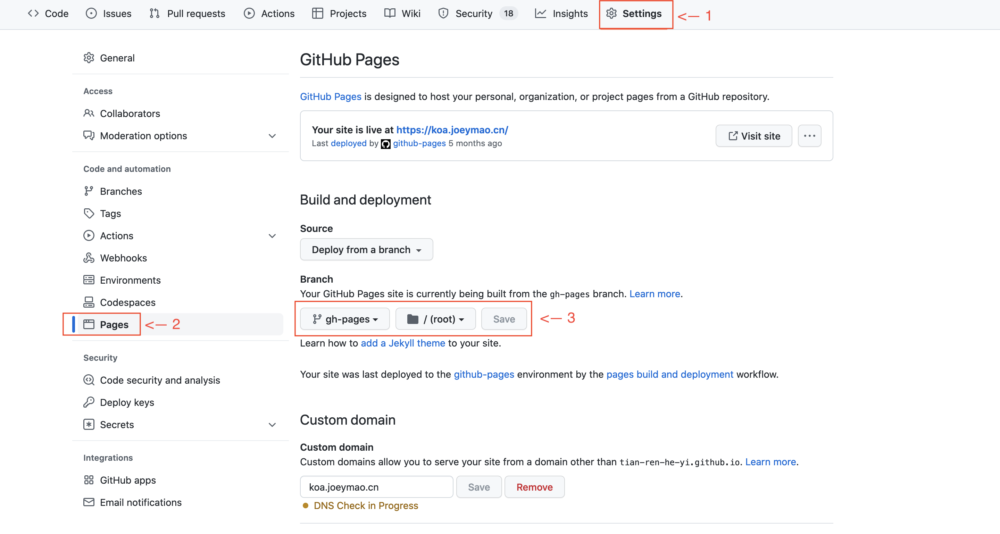

## 创建github仓库

1. 需要按照`username.github.io`的格式创建！

2. 仓库创建完成后，再为username.github.io仓库`开启pages`！
我这边单独创建了`gh-pages`分支，可以直接用`main`分支，看个人喜好。

如下图: 




## 创建deploy.sh

`deploy.sh`文件代码如下:

```
# 确保脚本抛出遇到的错误
set -e

# 生成静态文件
npm run docs:build

# 进入生成的文件夹
cd docs/.vuepress/dist

# 如果是发布到自定义域名
echo 'koa.joeymao.cn' > CNAME

git init
git add -A
git commit -m 'deploy'

# 如果发布到 https://<USERNAME>.github.io, 此处替换刚刚创建的github仓库
git push -f git@github.com:<USERNAME>/<USERNAME>.github.io.git main

cd -
```

文件创建完成后，将以上代码复制并保存。接着需要找到`package.json`文件进行以下设置:
```
"scripts": {
    "docs:dev": "vuepress dev docs",
    "docs:build": "vuepress build docs",
    "deploy": "bash deploy.sh"
},
```
最后执行`npm run deploy`