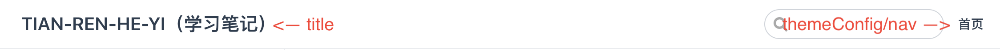

## config.js (导航链接)

参数配置

```
module.exports = {
    head: [
        ['link', { rel: 'icon', href: '/images/favicon.ico' }]
    ],
    title: "TIAN-REN-HE-YI（学习笔记）",
    description: "",
    themeConfig: {
        nav: [
            { text: '首页', link: '/' },
            {
                text: 'Tools',
                items: [
                    { text: 'VuePress', link: '/guide/tools/vuePress/introduce/' },
                ]
            },
        ],
    }
};
```

效果图如下:



其余参数表达:
| 参数        | 表达          | 值(类型)           |
| :---       |    :---       |          :--- |
| head       | 浏览器图标 | String  |
| description   |  描述   | String |