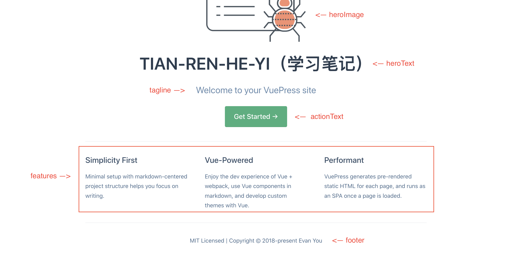

<style>
   @import "../../css/style.css"
</style>

<div class="body">
    <div class="content">
        <span class="title">注意</span><br/>
        <span>此处只适用于默认配置主题</span>
    </div>
</div>

## README.md (主页)
参数配置
```
---
home: true
heroImage: /hero.png
actionText: Get Started →
heroText: TIAN-REN-HE-YI（学习笔记）
tagline: Welcome to your VuePress site
actionLink: /guide/
features:
- title: Simplicity First
  details: Minimal setup with markdown-centered project structure helps you focus on writing.
- title: Vue-Powered
  details: Enjoy the dev experience of Vue + webpack, use Vue components in markdown, and develop custom themes with Vue.
- title: Performant
  details: VuePress generates pre-rendered static HTML for each page, and runs as an SPA once a page is loaded.
footer: MIT Licensed | Copyright © 2018-present Evan You
---
```
效果图如下:



其余参数表达:
| 参数        | 表达          | 值(类型)           |
| :---       |    :---       |          :--- |
| home       | 打开或取消首页展示 | Boolean  |
| actionLink   |   actionText 按钮跳转链接   | String |

